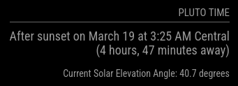

# Module: PlutoTime

**PlutoTime** is a module for [MagicMirror²](https://magicmirror.builders/). It calculates the next time on a clear morning or evening that you can go outside and experience the brightness of high noon on Pluto.

The code has been obtained from [NASA's](https://science.nasa.gov/dwarf-planets/pluto/plutotime) website on the topic.

## Screenshot



## Installation

Just clone the module into your modules folder of your MagicMirror²:

```bash
cd ~/MagicMirror/modules
git clone https://github.com/croxis/PlutoTime
```

## Configuration

To use this module, add it to the modules array in the `config/config.js` file:

```javascript
    {
        module: "PlutoTime",
        position: "top_right", // This can be any of the regions.
        header: "Pluto Time",
        config: {  // Place the latitude and longitude of your mirror.
                 latitude: 45.5,
                 longitude: -122.38
        }
    },
```

## Update

Go to the module’s folder inside MagicMirror modules folder and pull the latest version from GitHub:

```bash
cd ~/MagicMirror/modules/PlutoTime
git pull
```
